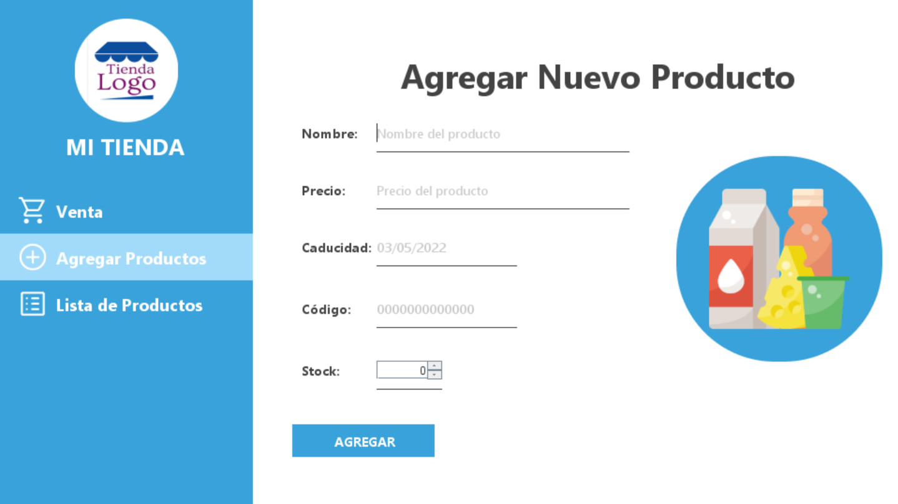
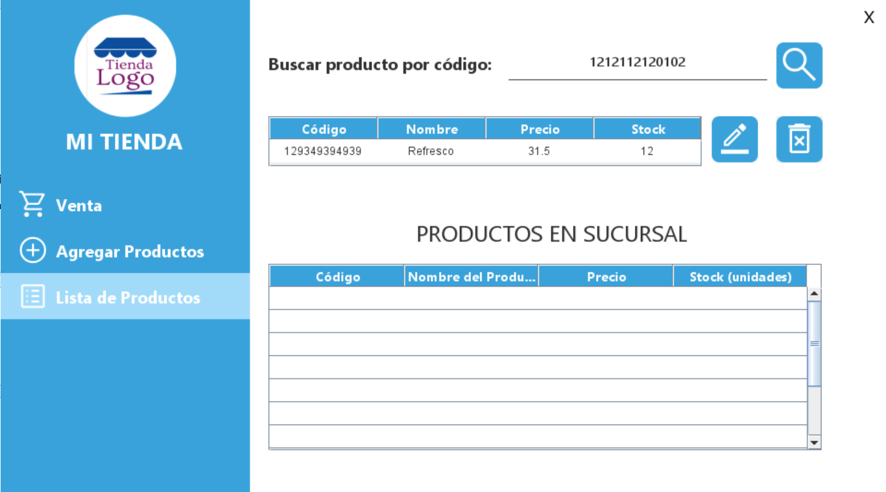
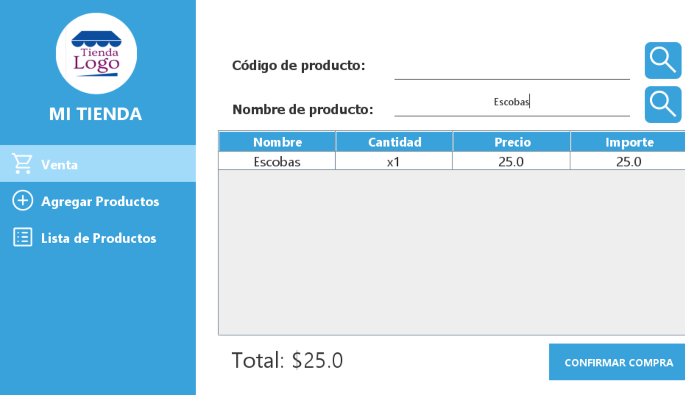
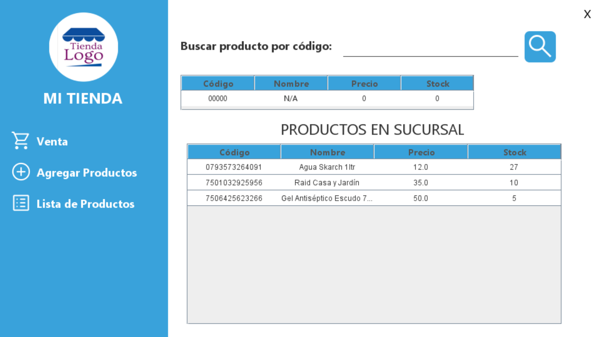

# ADMINISTRADOR DE TIENDA

Aplicación de escritorio para llevar una gestión de los productos de una tienda minorista.
El usuario puede realizar las siguientes acciones:

- Registra los productos en la aplicación, ingresando su nombre,
  precio,caducidad, codigo del producto y stock.
- Ver la lista de todos los productos registrados en la aplicación, buscar entre ellos, seleccionar uno,editarlo o eliminar.
  -Vender los productos, puede buscarlos por nombre o codigo mostrando la cantidad y la suma total. Al confirmar la compra, la cantidad de productos vendidos es descontada del stock.

**Aplicación desarrollada en Java con su libreria Swing y utilizando el gestor de base de datos SQLite**

# Capturas

